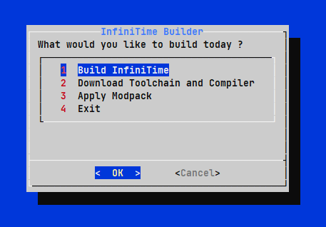

# InfiniTime Builder



simple script to help automate and build InfiniTime firmware for the pinetime

get it with:
`git clone https://github.com/ZephyrLabs/InfiniTime-Builder.git`

to build firmware, make sure you have installed:
* from your choice of package manager -> wget, curl, cmake, python3, python3-pip, dialog
* from python3-pip -> cbor, intelhex, adafruit-nrfutil


run it with:
```
cd InfiniTime-Builder
chmod +x run.sh
./run.sh
```

### Make sure you have Installed the Toolchain and Compiler first before Building InfiniTime


## Notes:
* Installing toolchain might take 5-10 minutes
* building from scratch will delete the old InfiniTime repo so backup changes you made if you need to!

## Modpacks:
Modpacks are simple zip packages, containing files that need to be replaced for
customizing your InfiniTime build and are simple to create and redistribute

an example structure of a Modpack is something like this:
```

something-Modpack.zip
                     |
                     \__Modpack
                            |
                            |\__ preview.png
                            |
                            \__ src
                                   |
                                   |\__ displayapp
                                   |              |
                                   |              |\__ screens
                                   |              |           |\__ WatchfaceAnalog.cpp
                                   |              |           |
                                   |              |           \__ WatchFaceDigital.cpp
                                   |              \__ icons
                                   |                       |
                                   \__ systemtask          \__ bg_clock.c
                                                 |
                                                 \__ SystemTask.cpp
```

all modified files are in the correct directory order inside the 
`/src` directory

the modpack can also be applied as a zip (automatic unzipping) or a previously extracted directory

### note: 
after applying a modpack the Infinitime source code will be 
changed, hence if you are building Infinitime from the 
`Build InfiniTime` option, do not select build from scratch, 

building from scratch will wipe all data and pull new code 
directly from the github repo

Modpacks will be soon availabe from the [Watchface Repo](https://zephyrlabs.github.io/Watchfaces/)
